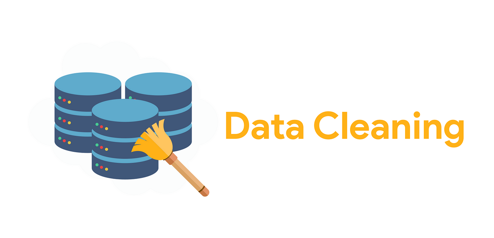
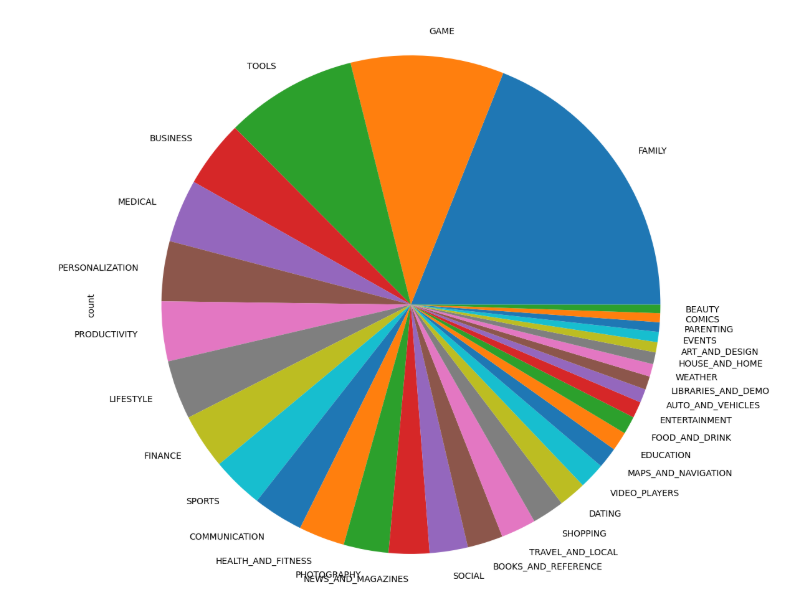
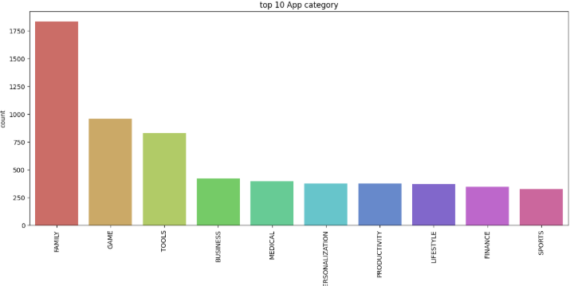

## EDA and Feature Engineering fr google app store




This is an end-to-end data cleaning, EDA, and feature engineering project,
which includes the process of cleaning the dataset using the pandas library and visualizing data distribution using matplotlib to detect outliers.
Additionally, this project includes reusable code to automate the processes of loading, cleaning, and saving the data file.

## 🎯 Project Objectives

furthermore this projct will answer the following quetions:
1. find the most popuplar Category
2. find the App with the largest number of installs
3. and finally the App with larggest Size

## 🗂️ Data Structure Overview

This project is based on a dataset from Kaggle representing the Google Play Store.
We will not provide an in-depth explanation of every single column and its data type.
Instead, we will focus on cleaning and converting each column into its proper data type.


## 📁 Project Structure

- `google-playstore-EDA/`
  - `README.md` — Project overview and instructions
  - `requirements.txt` — List of Python dependencies
  - `setup.py` — Project setup configuration
  - `data/` — Raw and cleaned datasets
  - `notebooks/` — Jupyter notebooks for EDA and experiments
  - `outputs/` — Generated outputs (figures, reports, CSV files)
  - `scripts/` — Python scripts to run data processing tasks
  - `src/` — Source code: data cleaning, feature engineering modules
  - `google_playstore_eda.egg-info/` — Packaging metadata (auto-generated)


## 📊 Key Insights from the Dataset

1. **Most Popular Category:**


   The most popular category is **Family**, followed by:
   - Family
   - Game
   - Tools
   - Business
   - Medical
   - Personalization
   - Productivity
   - Lifestyle
   - Finance
   - Sports


2. **App with the Largest Number of Installs:**
   The apps with the largest number of installs are **Instagram** and **Twitter**.


## 🚀 How to Use This Project

### 1️⃣ Clone the Repository

Clone the project using Git:

```bash
git clone https://github.com/your-username/google-playstore-EDA.git
```
### 2️⃣ Navigate to the Project Directory

```bash
cd google-playstore-EDA
```

### 3️⃣ Install the Required Dependencies
```bash
    pip install -r requirements.txt
```
### 4️⃣ Run the Data Cleaning Script

```bash
    cd scripts
    python run.py

```


## 📄 Report

👉 [Click here to view the full report (PDF)]()

## 🙋‍♂️ About Me

**Mohammed Ayoub Essbai**

Data Analyst | Power BI Enthusiast | Python Developer

🔗 [LinkedIn](https://www.linkedin.com/in/mohammed-ayoub-essbai/)

💻 [GitHub](https://github.com/ayoub22222222)

